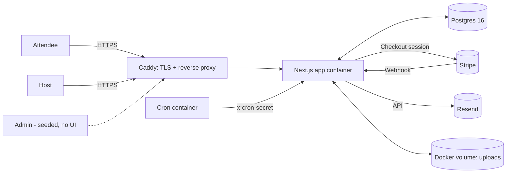
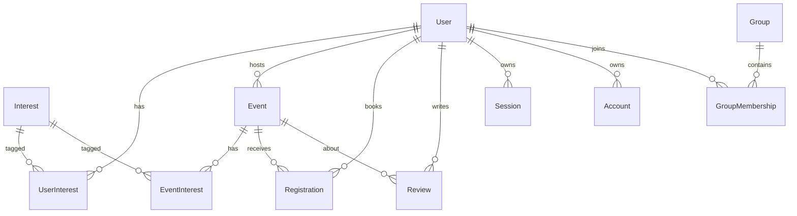

# Community Builder — Architecture (v1)

Single Next.js 15 modular monolith behind Caddy on one VPS. Postgres + Stripe + Resend. Separate cron container. Solo build.

---

## 1. System Context



---

## 2. Stack Confirmation

- **Next.js 15 App Router + RSC**: one deploy unit, RSC for the feed page avoids an internal API hop, route handlers cover the external surface (Stripe webhook, cron, auth).
- **Postgres 16**: single transactional store; capacity check is `SELECT ... FOR UPDATE` inside a tx — no queue needed.
- **Prisma**: typed client + built-in migrations. **Flag**: the ranking query is raw SQL via `$queryRaw` — Drizzle would be cleaner there, but Prisma's ergonomics elsewhere win for a solo build.
- **Auth.js (NextAuth) credentials + email verification**: Prisma adapter, DB sessions (see §5). **Flag**: credentials provider is the weakest part of Auth.js; if email verification logic grows I'd swap to Lucia. Not today.
- **Stripe Checkout (hosted) + webhook**: zero PCI scope; webhook is the only trusted state transition.
- **Resend + React Email**: typed templates, trivial DX for three templates at low volume.
- **Tailwind + shadcn/ui**: copy-paste components, no runtime component dep.
- **Caddy**: automatic local/staging TLS, 10-line Caddyfile.
- **Node cron container**: separate compose service POSTs to `/api/cron/*` with `x-cron-secret`. Keeps scheduling concern out of the app image.
- **Local Docker volume + `Storage` interface**: `LocalStorage` writes to `/data/uploads`; `S3Storage` is the swap target. No app code imports the filesystem directly.
- **Zod at the boundary**: every route handler and server action parses input through a module-owned schema before the domain sees it.

---

## 3. Data Model

Tags: **[PII]** personal data, **[PAY]** payment reference.



```prisma
// prisma/schema.prisma
datasource db { provider = "postgresql"; url = env("DATABASE_URL") }
generator client { provider = "prisma-client-js" }

enum Role { ATTENDEE ADMIN }
enum RegistrationStatus { PENDING PAID REFUNDED CANCELLED }

model User {                              // [PII]
  id               String   @id @default(cuid())
  email            String   @unique       // [PII]
  passwordHash     String                 // [PII]
  emailVerifiedAt  DateTime?
  displayName      String
  bio              String?
  city             String?
  profession       String?
  role             Role     @default(ATTENDEE)
  referralCode     String   @unique       // own code, generated
  referredByCode   String?                // captured, not rewarded in v1
  createdAt        DateTime @default(now())
  updatedAt        DateTime @updatedAt
  interests        UserInterest[]
  events           Event[]        @relation("HostedEvents")
  registrations    Registration[]
  reviews          Review[]
  sessions         Session[]
  accounts         Account[]
  memberships      GroupMembership[]
}

model Interest {
  id     String @id @default(cuid())
  slug   String @unique
  label  String
  users  UserInterest[]
  events EventInterest[]
}

model UserInterest {
  userId     String
  interestId String
  user       User     @relation(fields: [userId], references: [id], onDelete: Cascade)
  interest   Interest @relation(fields: [interestId], references: [id])
  @@id([userId, interestId])
  @@index([interestId])
}

model Event {
  id             String  @id @default(cuid())
  hostId         String
  host           User    @relation("HostedEvents", fields: [hostId], references: [id])
  title          String
  description    String
  startsAt       DateTime
  endsAt         DateTime
  timezone       String  // IANA, e.g. "America/Los_Angeles"
  addressText    String
  lat            Float?
  lng            Float?
  capacity       Int
  priceMinor     Int     // USD cents
  coverImagePath String?
  cancelledAt    DateTime?
  createdAt      DateTime @default(now())
  updatedAt      DateTime @updatedAt
  interests      EventInterest[]
  registrations  Registration[]
  reviews        Review[]
  @@index([startsAt])
}

model EventInterest {
  eventId    String
  interestId String
  event      Event    @relation(fields: [eventId], references: [id], onDelete: Cascade)
  interest   Interest @relation(fields: [interestId], references: [id])
  @@id([eventId, interestId])
  @@index([interestId])
}

model Registration {                               // [PAY]
  id                      String   @id @default(cuid())
  userId                  String
  eventId                 String
  status                  RegistrationStatus @default(PENDING)
  amountMinor             Int
  stripeCheckoutSessionId String?  @unique        // [PAY]
  stripePaymentIntentId   String?  @unique        // [PAY]
  createdAt               DateTime @default(now())
  paidAt                  DateTime?
  user                    User  @relation(fields: [userId], references: [id])
  event                   Event @relation(fields: [eventId], references: [id])
  @@unique([userId, eventId])                     // one registration per user per event
  @@index([eventId, status])
}

model Review {
  id        String   @id @default(cuid())
  userId    String
  eventId   String
  stars     Int      // 1..5 enforced in Zod + CHECK constraint
  text      String
  createdAt DateTime @default(now())
  user      User  @relation(fields: [userId], references: [id])
  event     Event @relation(fields: [eventId], references: [id])
  @@unique([userId, eventId])
}

// Auth.js adapter tables
model Account {                                    // [PII] via provider IDs
  id String @id @default(cuid())
  userId String
  type String
  provider String
  providerAccountId String
  refresh_token String? @db.Text
  access_token  String? @db.Text
  expires_at    Int?
  token_type    String?
  scope         String?
  id_token      String? @db.Text
  session_state String?
  user User @relation(fields: [userId], references: [id], onDelete: Cascade)
  @@unique([provider, providerAccountId])
}

model Session {                                    // [PII]
  id           String   @id @default(cuid())
  sessionToken String   @unique
  userId       String
  expires      DateTime
  user         User @relation(fields: [userId], references: [id], onDelete: Cascade)
}

model VerificationToken {                          // [PII]
  identifier String
  token      String   @unique
  expires    DateTime
  @@unique([identifier, token])
}

// Deferred — type anticipated, no routes/UI in v1
model Group {
  id        String   @id @default(cuid())
  name      String
  createdAt DateTime @default(now())
  members   GroupMembership[]
}

model GroupMembership {
  userId  String
  groupId String
  role    String @default("MEMBER")
  user    User  @relation(fields: [userId], references: [id], onDelete: Cascade)
  group   Group @relation(fields: [groupId], references: [id], onDelete: Cascade)
  @@id([userId, groupId])
}
```

---

## 4. API Surface

Legend: **RH** = route handler (`app/api/.../route.ts`), **SA** = server action, **P** = RSC page (no API, listed because brief asks for auth on reads).

### Auth / users
| Method | Path | Role | Type | Purpose |
|---|---|---|---|---|
| * | `/api/auth/[...nextauth]` | public | RH | Auth.js signup, login, session |
| POST | `/api/auth/verify` | public (token) | RH | Consume email verification token |
| — | `updateProfile` | user | SA | Update name, bio, interests, city, profession |

### Events
| Method | Path | Role | Type | Purpose |
|---|---|---|---|---|
| GET | `/events/[id]` | public | P | Event detail |
| GET | `/feed` | user | P | Ranked feed (see §7) |
| — | `createEvent` | user → host | SA | Create event, host = session user |
| — | `updateEvent` | host(own) | SA | Edit own event |
| — | `cancelEvent` | host(own) | SA | Soft-cancel (sets `cancelledAt`) |
| POST | `/api/uploads/cover-image` | user | RH | Multipart upload via `Storage` |

### Registrations / payments
| Method | Path | Role | Type | Purpose |
|---|---|---|---|---|
| — | `startCheckout(eventId)` | user (verified) | SA | Create Stripe Checkout session, return URL |
| POST | `/api/webhooks/stripe` | signed | RH | `checkout.session.completed` → mark PAID |
| GET | `/me/events` | user | P | My upcoming / past registrations |

### Reviews
| Method | Path | Role | Type | Purpose |
|---|---|---|---|---|
| — | `submitReview(eventId, stars, text)` | user (registered, past) | SA | Create review |

### Host
| Method | Path | Role | Type | Purpose |
|---|---|---|---|---|
| GET | `/host/events` | host | P | Events I host |
| GET | `/host/events/[id]` | host(own) | P | Attendees + revenue |

### Cron (shared-secret header `x-cron-secret`)
| Method | Path | Role | Type | Purpose |
|---|---|---|---|---|
| POST | `/api/cron/reminders` | cron | RH | Day-of reminder emails |
| POST | `/api/cron/cleanup` | cron | RH | Expire PENDING registrations past TTL |

All mutation routes: Zod parse → authz check → domain call. No exceptions.

---

## 5. Auth Model

**Session strategy: JWT sessions** via Auth.js. Originally specced as DB sessions, but Auth.js v5 only supports DB sessions with OAuth providers — the credentials provider **requires** JWT. The Prisma adapter still manages account linking + verification tokens. Cookie is HTTP-only, SameSite=Lax, Secure in prod. Revocation on password change: the next login issues a new JWT; existing tokens expire at their `exp`.

**Roles:**
- `ATTENDEE` — default, everyone.
- `ADMIN` — seeded one row, no UI in v1 (matches CUT list).
- **Host** is a capability, not a role: a user is "a host" for events where `event.hostId = session.userId`. Avoids a role flag that drifts from reality.

**Resource rules (enforced in domain service, not middleware):**
- Event write (update/cancel, upload cover): `session.user.id === event.hostId || session.user.role === ADMIN`.
- Start checkout: authenticated AND `emailVerifiedAt IS NOT NULL` AND event not cancelled AND `startsAt > now`.
- Capacity: transactional. Inside `prisma.$transaction`: `SELECT COUNT(*) ... FOR UPDATE` paid+pending, reject if `>= capacity`.
- Stripe webhook: `stripe.webhooks.constructEvent` with the signing secret. No session check.
- Cron routes: constant-time compare `x-cron-secret` against `CRON_SHARED_SECRET`. No session.
- Review write: registration exists AND `status = PAID` AND `event.startsAt < now` AND unique `(userId, eventId)`.
- Host dashboard read: `event.hostId === session.user.id`.

Email verification: signup issues a `VerificationToken`, Resend mails the link, `/api/auth/verify` consumes it and sets `emailVerifiedAt`. Unverified users can log in but cannot pay or register.

---

## 6. Folder Structure

```
app/       Next.js routes (pages, layouts, route handlers, server actions colocated with features)
lib/       Domain modules (users, events, registrations, reviews, payments, notifications) + infra (db, auth, storage, zod, stripe, email); cross-domain access only via each module's index.ts
prisma/    schema.prisma, migrations/, seed.ts
emails/    React Email templates: verification, registration-confirmation, event-reminder
docker/    Dockerfile.app, Dockerfile.cron, Caddyfile, compose.yml, compose.override for dev
scripts/   entrypoint.sh (migrate + start), cron-tick.sh (loop hitting cron endpoints), seed wrapper
```

---

## 7. Ranking Query

Single query, executed via `prisma.$queryRaw`. Returns a page of upcoming events for a user, ordered by count of overlapping interest tags, tiebreak by soonest `startsAt`.

```sql
SELECT
  e.id,
  e.title,
  e.starts_at,
  e.cover_image_path,
  COUNT(ui.interest_id)::int AS overlap
FROM "Event" e
LEFT JOIN "EventInterest" ei ON ei.event_id = e.id
LEFT JOIN "UserInterest"  ui ON ui.interest_id = ei.interest_id AND ui.user_id = $1
WHERE e.starts_at > NOW()
  AND e.cancelled_at IS NULL
GROUP BY e.id
ORDER BY overlap DESC, e.starts_at ASC
LIMIT $2 OFFSET $3;
```

Notes:
- `LEFT JOIN` on `UserInterest` scoped to the viewer keeps zero-overlap events in the result (still rankable by time).
- No per-request N+1: single round-trip.
- Pagination is offset-based in v1; swap to keyset `(overlap, starts_at, id)` when the feed grows.
- Prisma column names will be the default snake_case mapping; final names confirmed at implementation.

---

## 8. Known Risks & Deliberate Punts

1. **No rate limiting.** Auth, checkout, and webhook endpoints are exposed; brute-force and signup spam are accepted risks for v1. Caddy access logs are the only signal.
2. **No GDPR export / erase.** User deletion leaves `Registration` rows (payment record retention); no self-serve export. Compliance deferred.
3. **No image moderation.** Cover image uploads are trusted; reliance on host accountability and post-hoc takedown.
4. **Upload volume not backed up.** Local Docker volume; disk loss = permanent image loss. `Storage` interface exists so we can swap to R2/S3 the day this matters.
5. **Cron container is a SPOF.** If the cron service is down at reminder time, that day's reminders are silently skipped — no retry ledger, no alerting.
6. **Secrets in `.env` on the host.** No Vault/KMS; single-admin trust model.
7. **Pushback on brief:** "separate host reviews" is in CUT but wording elsewhere is ambiguous — I'm treating it as event-reviews-only, no host-level aggregate review entity. Flag if that's wrong before Phase 2.
8. **Pushback on stack:** raw SQL in Prisma is fine for one query; if a second ranking dimension lands (distance, recency decay), I'd rather migrate that module to Drizzle than stack `$queryRaw` calls.

---

**Stop. Awaiting approval to start Phase 2.**
